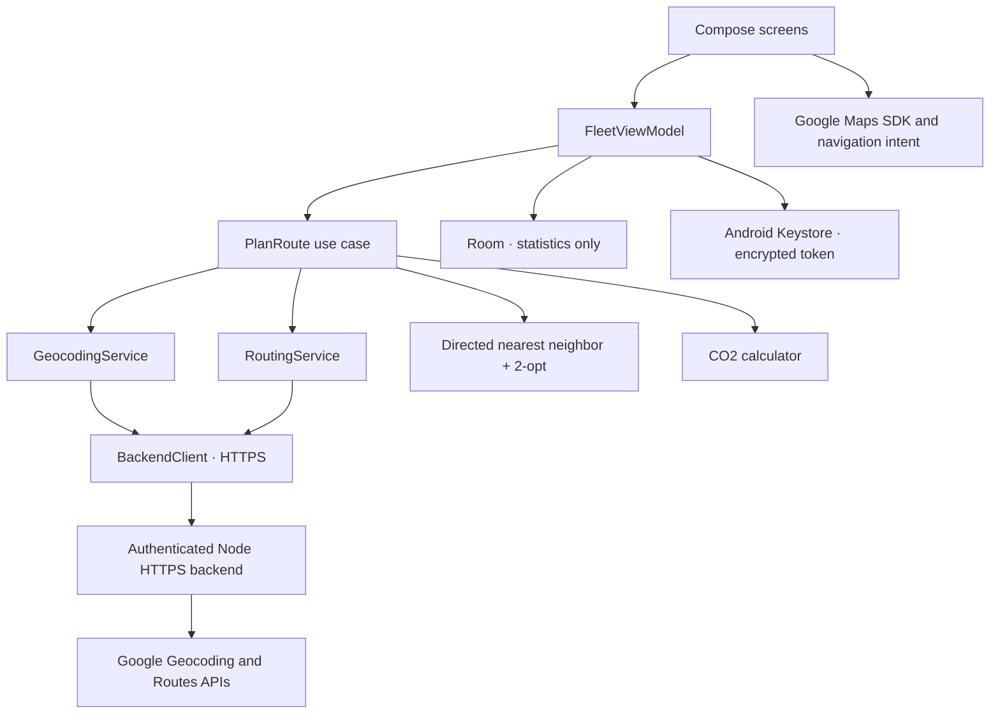

# GreenFleet

A native Android MVP for one-car, multi-stop round trips, built with Kotlin and Jetpack Compose. It minimizes the sum of **driving distances returned by the road-routing provider**, with duration as a tie-breaker. A configurable distance-based model estimates tailpipe CO₂.

The project includes a working offline demo, a Google Routes/Geocoding HTTPS backend, Google Maps display, external Google Maps navigation for each leg, manual arrival confirmation, and the last 20 route summaries in Room.

## Run the Android app

Open this directory in Android Studio. Use JDK 17, Android SDK 36 and an Android 8.0+ device/emulator. The pinned Gradle wrapper includes distribution checksum verification.

```sh
./gradlew :app:assembleDebug
./gradlew :app:installDebug
```

The APK is `app/build/outputs/apk/debug/app-debug.apk`.

No credentials are needed for the demo. Open GreenFleet, read the privacy notice, choose **Load Amsterdam demo**, then **Optimize round trip**. **Simulate arrival** advances through every destination and the return leg. No location permissions, maps, or network requests are used in demo mode.

## Connect live routing

1. In your Google Cloud project, enable billing, **Routes API**, **Geocoding API**, and **Maps SDK for Android**.
2. Create a server key restricted to Routes/Geocoding and your backend's outbound IP address. Set `GOOGLE_MAPS_SERVER_KEY` on the backend; it is never shipped in the APK.
3. Create a separate Maps SDK for Android key restricted to package `com.greenfleet.app`, your signing certificate SHA-1, and the Android Maps SDK. Add it to the ignored `local.properties` file and rebuild:

   ```properties
   sdk.dir=/absolute/path/to/Android/sdk
   MAPS_API_KEY=your_android_restricted_maps_key
   ```

   Alternatively inject `MAPS_API_KEY` from the build environment. Run `./gradlew :app:signingReport` to inspect the debug certificate. A release uses its own signing certificate.

4. Follow [backend setup](backend/README.md) and provide a reachable HTTPS origin with a valid, system-trusted TLS certificate. The Android app rejects HTTP, user info, query strings, and redirects; it has no development certificate bypass.
5. In **Settings**, enter the HTTPS origin and the backend access token. Save, switch the planner to **Live road routing**, and enter complete street addresses or `latitude,longitude` pairs. The Android map key must be configured before live planning.

The Maps SDK key is a client identifier that the SDK requires in Android metadata; it is extractable from an APK and **is not a secret that Keystore can hide**. Restrict it by package/signing certificate/API. Backend access tokens are encrypted using a non-exportable Android Keystore AES-GCM key. Server provider credentials stay on the server. See [Google's API security guidance](https://developers.google.com/maps/api-security-best-practices) and [Android Keystore](https://developer.android.com/privacy-and-security/keystore).

Live Google API calls have not been exercised with a paid provider account. Contract tests use controlled fixtures, including HTTPS between the Android client and its test server. Provider setup and an actual live route remain deployment-time checks.

## Routing decisions

| Requirement | Implementation |
|---|---|
| Start and return | Depot index 0 appears at both ends; the return is included in all totals. |
| Final destination | Last unique location is fixed immediately before the depot return. Without a separate final, the last entered drop-off is fixed there. |
| Stops | UI accepts 2–20 drop-offs. Domain and backend support 50 drop-offs plus depot and a separate final. |
| Accurate costs | Directed Google driving matrix; never straight-line approximations in live mode. A-to-B and B-to-A costs stay separate. |
| Objective | Minimize distance, then duration for equal distance. Fixed g/km means minimizing distance also minimizes estimated CO₂. |
| Heuristic | Up to eight nearest-neighbor seeds plus the baseline; directed 2-opt, maximum 30 improvement passes per seed. |
| Safety comparison | Keep entered order as a candidate. Fetch full baseline and optimized road paths; if actual returned optimized legs are worse, retain baseline. |
| Traffic | `TRAFFIC_UNAWARE` for both matrix and full route, ensuring the same planning policy. Times exclude traffic, service time and idling. |
| Geometry | Google's full road polyline, never a line drawn directly between live stops. |
| Background work | Networking is asynchronous; optimization runs on `Dispatchers.Default`, with cooperative cancellation and a five-minute overall limit. |
| Arrival | Driver manually confirms every destination and the depot return. Launching navigation alone never completes a leg. |
| History | Room keeps date, stop count, distance, duration, CO₂, factor, demo flag and progress. No address/geometry persistence or route replay. |

The heuristic is not an exact TSP solver and does not promise a global optimum. It optimizes stop order over Google's chosen car paths, rather than guaranteeing the shortest possible road path between every pair. Driving time can increase when distance decreases; the comparison displays that trade-off explicitly.

There are no capacity constraints, time windows, multiple vehicles, background tracking or driving telemetry. Current route geometry and progress remain in memory during the app session; process death discards the active route. History retains its last saved statistics. Opening Google Maps passes the next destination; that app can choose a different leg path, so planned estimates are not a record of actual driving.

Lower average speed is **not** treated as an automatic CO₂ benefit. Speed-dependent fuel consumption requires a calibrated model and additional inputs. The default **180 g/km is illustrative**, configurable from 1–1000 g/km. The MVP does not model elevation, congestion, acceleration, cold starts, vehicle load, fuel production or lifecycle emissions.

Google matrix requests are tiled into at most 25 × 25 elements. Full route requests contain at most 25 intermediate stops, overlapping only the chunk boundary. A 52-location matrix has 2,704 billed elements; smaller UI routes with a separate final have at most 484. Review [Google's matrix limits](https://developers.google.com/maps/documentation/routes/compute_route_matrix) and [usage and billing](https://developers.google.com/maps/documentation/routes/usage-and-billing).

## Architecture and Kotlin entry points



`domain` is a pure JVM module with no Android or Google dependency. `app` contains presentation and data adapters. `backend` uses Node 22+ built-in modules and has no external packages. The service boundaries allow replacing Google, introducing another emission model, or adding a future fleet solver without coupling the optimizer to the UI.

Core models are in [Models.kt](domain/src/main/kotlin/com/greenfleet/domain/Models.kt):

```kotlin
data class Location(
    val id: String,
    val name: String,
    val address: String,
    val coordinate: Coordinate,
    val type: LocationType,
)

// Vehicle validates the configurable factor; RoadCost validates distance and duration.
val vehicle = Vehicle(emissionFactorGPerKm = 180.0)
val co2Grams = Co2Calculator.grams(distanceKm = 12.0, vehicle = vehicle) // 2160 g
```

The [service interfaces and use case](domain/src/main/kotlin/com/greenfleet/domain/PlanRoute.kt) are:

```kotlin
interface GeocodingService {
    suspend fun geocode(input: String, type: LocationType, id: String): Location
}
interface RoutingService {
    suspend fun matrix(locations: List<Location>): RoadMatrix
    suspend fun route(orderedLocations: List<Location>): RoadPath
}

// Call from a coroutine. The use case handles validation, geocoding, the directed
// matrix, optimization, full-path verification, and baseline comparison.
val provider = DemoProvider()
val route = PlanRoute(provider, provider)(
    request = DemoProvider.request,
    vehicle = Vehicle(emissionFactorGPerKm = 180.0),
    isDemo = true,
)
println(route.optimizedOrder)
println(route.co2SavedGrams)
```

See [RouteOptimizer.kt](domain/src/main/kotlin/com/greenfleet/domain/RouteOptimizer.kt) for the bounded heuristic and [BackendClient.kt](app/src/main/java/com/greenfleet/app/data/BackendClient.kt) for explicit JSON validation and bounded polyline decoding.

## End-to-end example: five drop-offs and final destination

**Synthetic demo fixture, not actual Amsterdam road distances.** Addresses name the example; its known graph weights make the output deterministic and testable. The offline visualization is labeled as a diagram, not a map of real driving paths.

| Entered position | Address | Role |
|---|---|---|
| 0 | De Ruijterkade 34, Amsterdam | Depot |
| 1 | Museumstraat 1, Amsterdam | Museum delivery |
| 2 | Prinsengracht 263, Amsterdam | Canal delivery |
| 3 | Europaplein 24, Amsterdam | South delivery |
| 4 | Amstel 1, Amsterdam | Amstel delivery |
| 5 | Linnaeusstraat 2, Amsterdam | East delivery |
| 6 | Oosterdokskade 143, Amsterdam | Fixed final destination |

Entered order: **Depot → Museum → Canal → South → Amstel → East → Final → Depot**.

Optimized order: **Depot → Canal → Amstel → Museum → South → East → Final → Depot**.

| Metric | Entered order | Optimized | Saved |
|---|---:|---:|---:|
| Distance, including return | 20 km | 12 km | 8 km (40%) |
| Driving duration | 40 min | 24 min | 16 min |
| Estimated CO₂ at 180 g/km | 3,600 g | 2,160 g | 1,440 g (1.44 kg) |

Both routes have a fixture speed of 30 km/h. The synthetic network assigns each location a position on a weighted line; distance is the network path length between those positions. No real environmental benefit is claimed from this demo. Live results come solely from validated provider responses.

## Security and privacy by layer

- **Presentation:** Privacy notice precedes use; location is optional, foreground-only, and requested only after a clear rationale. A foreground location read stops on leaving the activity, after a valid fix, or after 20 seconds. Manual input always works without permission. Tokens are masked and excluded from saved UI state.
- **Domain:** Validate addresses, coordinates, unique resolved points, finite non-negative matrix costs and exact leg counts. Unreachable pairs are errors, never zero-cost or straight-line substitutes. Cancel expensive work cooperatively.
- **Android data:** HTTPS only, system certificate trust, no redirect following, bounded responses, sanitized errors, no address/token logs or HTTP logging interceptors. Access tokens use authenticated AES-GCM encryption with a Keystore key and endpoint binding; changing the endpoint removes its token.
- **Persistence:** Only route statistics are saved. The 20-row retention limit is enforced transactionally. Cloud backups and device transfers are excluded. History can be deleted in the app. Active provider geometry is not cached on disk.
- **Backend:** Timing-safe bearer verification, request/body/response limits, quota and concurrency guards, outbound deadlines, no redirects, HTTPS-only provider calls, no request/response logging and no location persistence. It is a single-operator MVP service; public multi-user deployment needs per-user short-lived authentication and shared quota enforcement.

Google map attribution remains visible. Operator-facing release work includes configuring valid provider credentials and hosting details, and publishing the app-specific privacy/terms URLs required by the selected provider agreement. See [Routes policies](https://developers.google.com/maps/documentation/routes/policies).

## Verification

```sh
./gradlew :domain:test :app:testDebugUnitTest :app:lintDebug :app:assembleDebug
./gradlew :app:connectedDebugAndroidTest
cd backend
node --test
```

Coverage includes CO₂ arithmetic and invalid inputs; asymmetric matrices; fixed final with and without a separate final address; complete return leg; baseline fallback after full road-path verification; cancellation; 50-drop-off performance; HTTPS client contracts and malformed polylines; provider batch limits and out-of-order responses; backend authentication and request limits; the complete offline UI flow; Room retention/deletion; and Keystore token encryption.

See [verification notes](docs/VERIFICATION.md) for the executed checks and their limits.

